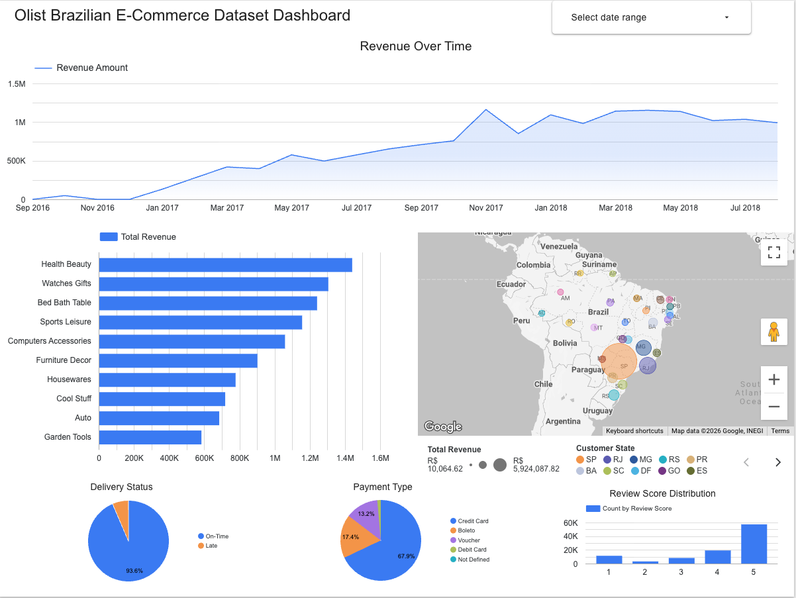
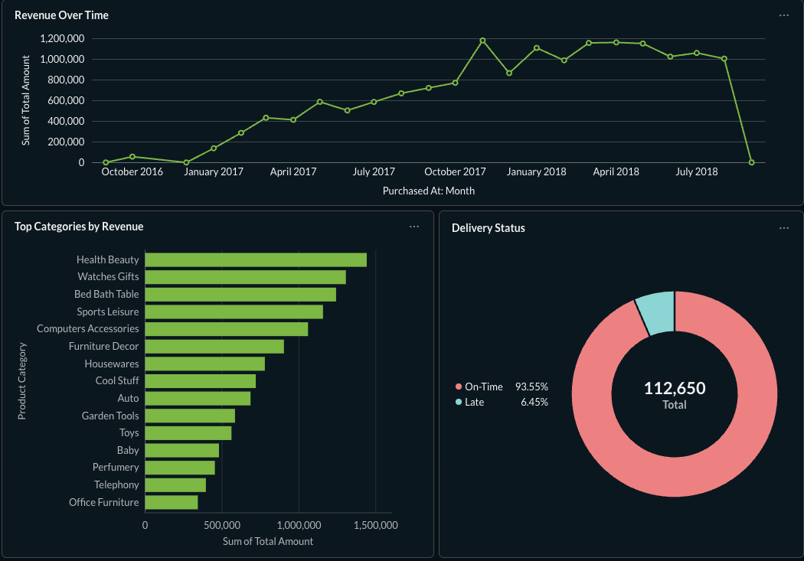
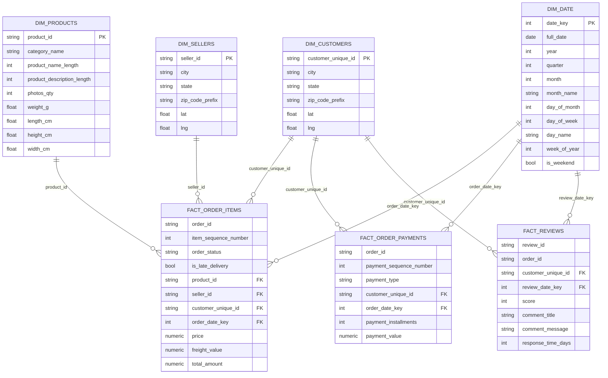

# AI-BI Data Pipeline

An end-to-end data engineering and business intelligence project demonstrating
a modern analytics stack: data ingestion, warehouse design, data quality,
and AI-assisted workflows feeding a BI visualization layer.

## Dashboards

### Looker Studio
Interactive dashboard covering revenue trends, product performance, delivery SLAs, and customer geography, built on top of the `reporting.rpt_order_items_summary` view and the `warehouse` fact tables.

[View live dashboard →](https://datastudio.google.com/u/0/reporting/aed1d70d-09e7-4f9f-a08f-bbefb02c8746/page/LZV3F)

### Metabase
The same set of visualizations recreated in Metabase (self-hosted via Docker), connected directly to the BigQuery warehouse — built to compare BI tooling on top of the same dimensional model.

## Stack
- **Warehouse:** Google BigQuery (GCP)
- **Storage:** Google Cloud Storage
- **Orchestration:** n8n (self-hosted)
- **BI / Visualization:** Metabase (self-hosted)
- **Language:** Python
- **Version Control:** GitHub

## Architecture
*Diagram coming soon*

## Project Phases
- [x] v1.0 — Ingest Olist e-commerce dataset, design star schema, build warehouse in BigQuery
- [ ] v2.0 — Add second data source (DataCo Supply Chain), demonstrate multi-source ingestion
- [ ] v3.0 — Add agentic AI workflows via n8n
- [ ] v4.0 — Metabase dashboards and reporting layer

## Data Sources
See [data/README.md](data/README.md) for source details and setup instructions.

## Data Warehouse Schema

The warehouse is modeled as a star schema (fact constellation) in BigQuery: three fact tables at different grains, sharing conformed dimensions.

The warehouse is modeled as a fact constellation rather than a single star: three fact tables — `fact_order_items`, `fact_order_payments`, and `fact_reviews` — sit at three different grains (line item, payment, and review respectively) and share a common set of conformed dimensions (`dim_customers`, `dim_products`, `dim_sellers`, `dim_date`). Payments and reviews are kept as their own fact tables rather than joined into `fact_order_items` because they're order-grain, not item-grain — folding them into the line-item fact would fan a single order's payment or review out across every item on that order, inflating totals. `dim_customers` is built at the `customer_unique_id` grain rather than `customer_id`, since Olist generates a new `customer_id` for every order; using it as the customer grain would make repeat buyers look like first-time customers on every purchase.

## Setup
*Instructions coming soon*

## Status
🚧 In Progress